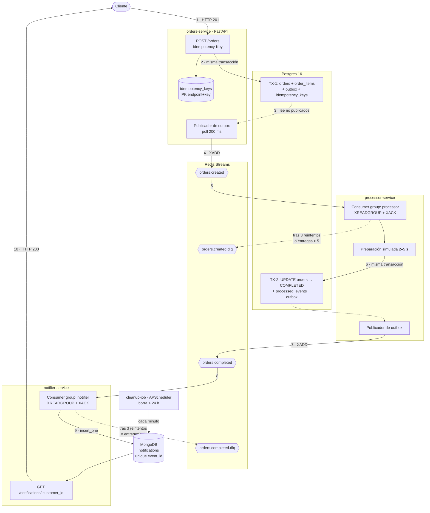
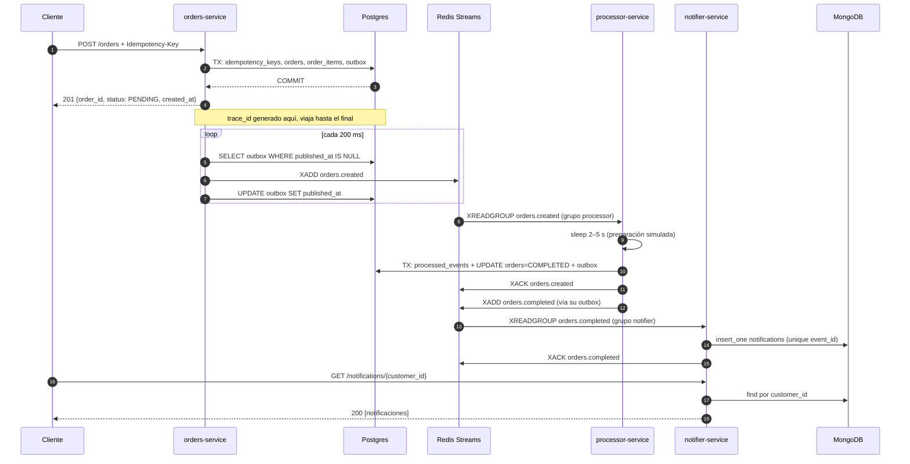

# Café Cloud

Sistema distribuido de pedidos de cafetería con comunicación asíncrona. Un cliente crea un pedido por
HTTP en **orders-service**, que lo persiste en Postgres junto a su evento en una tabla *outbox*, en la
misma transacción; un publicador lee esa tabla y emite `orders.created` a **Redis Streams**;
**processor-service** lo consume, simula la preparación de 2 a 5 segundos, marca el pedido como
`COMPLETED` y emite `orders.completed` por su propio outbox; **notifier-service** lo consume y escribe
la notificación en **MongoDB**, que el cliente consulta por HTTP; y un **cleanup-job** con APScheduler
borra cada minuto las notificaciones de más de 24 horas. Todo corre en Docker Compose, sin ninguna
dependencia de servicios en la nube: se clona el repositorio, se ejecuta `docker compose up --build` y
el entorno queda funcionando.

## Índice

1. [Componentes](#1-componentes)
2. [Cómo levantar el entorno](#2-cómo-levantar-el-entorno)
3. [Recorrido completo con curl](#3-recorrido-completo-con-curl)
4. [Salud, métricas y logs](#4-salud-métricas-y-logs)
5. [Cómo correr las pruebas](#5-cómo-correr-las-pruebas)
6. [Por qué cada decisión](#6-por-qué-cada-decisión)
7. [Alcance exacto de la garantía de idempotencia](#7-alcance-exacto-de-la-garantía-de-idempotencia)
8. [Contrato de eventos y payloads de ejemplo](#8-contrato-de-eventos-y-payloads-de-ejemplo)
9. [Diagrama de flujo](#9-diagrama-de-flujo)
10. [Variables de entorno](#10-variables-de-entorno)
11. [Limitaciones conocidas](#11-limitaciones-conocidas)
12. [Estructura del repositorio](#12-estructura-del-repositorio)

---

## 1. Componentes

`docker compose up` levanta **doce contenedores**: tres almacenes, dos migradores de un disparo que
terminan y se van, y siete procesos de aplicación. En marcha quedan diez.

| Contenedor | Qué hace | Escucha |
|---|---|---|
| `postgres` | Postgres 16. Dos esquemas: `orders` y `processor` | 5432 |
| `redis` | Redis 7 con AOF (`appendfsync everysec`). Broker de eventos | 6379 |
| `mongo` | MongoDB 7. Colección `notifications` con sus cuatro índices | 27017 |
| `orders-migrate` | `alembic upgrade head` del esquema `orders` y termina | — |
| `processor-migrate` | `alembic upgrade head` del esquema `processor` y termina | — |
| `orders-service` | API: `POST /orders`, `GET /orders/{order_id}` | 8001 |
| `orders-outbox-publisher` | Lee `orders.outbox` y publica `orders.created` | — |
| `processor-service` | Consume `orders.created`, completa el pedido y sirve `/health` y `/metrics` | 8002 |
| `processor-outbox-publisher` | Lee `processor.outbox` y publica `orders.completed` | — |
| `notifier-service` | API: `GET /notifications/{customer_id}` | 8003 |
| `notifier-consumer` | Consume `orders.completed` y escribe en MongoDB | 8004 |
| `cleanup-job` | APScheduler: borra notificaciones de más de 24 h | — |

Los dos publicadores de outbox y el `cleanup-job` **no sirven HTTP a propósito**: no guardan estado
que su almacén no revele, así que su salud se lee en el `/metrics` del proceso hermano que comparte
almacén (`cafecloud_outbox_rows`, `cafecloud_outbox_oldest_pending_age_seconds`,
`cafecloud_notifications_oldest_age_seconds`).

---

## 2. Cómo levantar el entorno

### Requisitos

**Solo Docker**, con el plugin `compose` (Docker Desktop lo trae). No hace falta Python, ni Poetry, ni
`pip install` en la máquina: todo, incluidos el *lint*, las pruebas y los datos de ejemplo, corre
dentro de contenedores. `make` es opcional; cada objetivo del `Makefile` es una línea de
`docker compose` que se puede escribir a mano.

Tampoco hay que copiar ni editar ningún archivo. `.env.example` está para consultar los valores por
defecto, pero **no hace falta copiarlo**: `docker-compose.yml` declara el mismo valor por defecto para
cada variable.

### Arranque

```bash
docker compose up --build -d      # equivalente: make up
docker compose ps                 # equivalente: make ps
```

Salida esperada de `docker compose ps`: **diez contenedores en marcha**, siete de ellos `healthy`
—los tres almacenes, las dos APIs y los dos consumidores— y tres en `Up` sin sonda: los dos
publicadores de outbox y el `cleanup-job`. Los dos migradores ya han terminado su trabajo, así que no
salen ahí; se ven con `docker compose ps -a`, en `Exited (0)`:

```bash
docker compose ps -a
```

### Migraciones

**No hay que ejecutarlas a mano.** Las dos cadenas de Alembic corren solas en el arranque, en los
contenedores `orders-migrate` y `processor-migrate`, y los servicios esperan a que terminen bien
(`depends_on: condition: service_completed_successfully`). Cada cadena corre con el rol dueño de su
esquema, que es lo que hace que el límite entre servicios lo imponga Postgres. Nunca se usa
`create_all`.

Para volver a aplicarlas a mano —es idempotente y no hace nada si ya están al día—:

```bash
make migrate
```

### Puertos y endpoints

Todos los puertos se publican en `127.0.0.1`. Se cambian con las variables de la sección 10.

| Endpoint | Puerto | Descripción |
|---|---|---|
| `POST /orders` | 8001 | Crea un pedido. Exige la cabecera `Idempotency-Key` |
| `GET /orders/{order_id}` | 8001 | Consulta un pedido |
| `GET /notifications/{customer_id}` | 8003 | Notificaciones de un cliente, con `limit` y `offset` |
| `GET /health`, `/health/live`, `/health/ready` | 8001, 8002, 8003, 8004 | Salud, en los cuatro procesos HTTP |
| `GET /metrics` | 8001, 8002, 8003, 8004 | Formato de exposición de Prometheus |

### Datos de ejemplo

```bash
make seed
```

Crea tres pedidos del cliente `cafe-demo` **por `POST /orders`**, nunca por `INSERT` directo, y espera
a que lleguen sus notificaciones: el seed es una demostración del flujo, no un volcado de estado
final. Si el sistema estuviera roto, el seed fallaría con código de salida 2. Corre dentro de la red
del Compose (`docker compose run --rm seed`), así que levanta el entorno si está caído y no necesita
`curl` ni `jq` en la máquina. Es re-ejecutable: cada pasada crea pedidos nuevos.

Salida real:

```
seed: 3 pedidos para el cliente 'cafe-demo'
  efa79e9c-88a2-4f86-93f5-f2a04d1875c6  PENDING  1x Cortado, 2x Croissant
  ed3b53d6-7314-40db-9445-30dbfeb4df8a  PENDING  2x Flat white
  cc3ae01f-4d71-4d99-b9a1-2fa0bdd514b2  PENDING  1x Espresso doble, 1x Tostada, 1x Zumo
esperando a que el sistema los complete y notifique...
notificaciones de 'cafe-demo': 15 (3 de esta pasada)

  curl -s localhost:8003/notifications/cafe-demo | jq
```

### Comandos disponibles

`make help` es la lista completa, con una línea por objetivo, y es la referencia buena porque se
ejecuta y no puede desincronizarse:

```bash
make help
```

Para detener el entorno conservando los datos:

```bash
make down                # docker compose down --remove-orphans
```

`make help` documenta además los objetivos que **sí borran datos** (`make down ARGS=-v` y
`make clean`); esta guía no los usa.

---

## 3. Recorrido completo con curl

Los ejemplos de abajo están ejecutados contra el entorno real y la salida es literal. No usan `jq`
para no exigir nada en la máquina; si lo tienes, añade `| jq` a cualquiera de ellos.

### 3.1 Crear un pedido

La `Idempotency-Key` la aporta el cliente y es obligatoria. Se guarda en una variable porque el paso
siguiente la reutiliza:

```bash
KEY="readme-$(date +%s)"

curl -s -i -X POST localhost:8001/orders \
  -H 'Content-Type: application/json' \
  -H "Idempotency-Key: $KEY" \
  -d '{"customer_id":"demo-readme","items":[{"name":"latte","qty":1},{"name":"muffin","qty":2}]}'
```

```http
HTTP/1.1 201 Created
content-type: application/json
x-trace-id: a337bce0-126d-4836-a6c6-59e61a437084

{"order_id":"2fbb9dbe-3fbd-4303-a737-a54e429a1839","customer_id":"demo-readme","status":"PENDING",
 "items":[{"name":"latte","qty":1},{"name":"muffin","qty":2}],"created_at":"2026-09-10T08:22:43.745Z"}
```

Anota el `x-trace-id`: reaparece al final, dentro de la notificación.

### 3.2 Reintentar con la misma `Idempotency-Key`

El mismo cuerpo y la misma clave devuelven **la respuesta original guardada**, con el mismo
`order_id`, y añaden la cabecera `idempotency-replayed`. No se crea un segundo pedido ni se emite un
segundo evento:

```bash
curl -s -i -X POST localhost:8001/orders \
  -H 'Content-Type: application/json' \
  -H "Idempotency-Key: $KEY" \
  -d '{"customer_id":"demo-readme","items":[{"name":"latte","qty":1},{"name":"muffin","qty":2}]}'
```

```http
HTTP/1.1 201 Created
idempotency-replayed: true

{"items":[{"qty":1,"name":"latte"},{"qty":2,"name":"muffin"}],"status":"PENDING",
 "order_id":"2fbb9dbe-3fbd-4303-a737-a54e429a1839","created_at":"2026-09-10T08:22:43.745Z",
 "customer_id":"demo-readme"}
```

La misma clave con **otro cuerpo** es un error del cliente, no un reintento, y se responde `409`:

```bash
curl -s -X POST localhost:8001/orders \
  -H 'Content-Type: application/json' \
  -H "Idempotency-Key: $KEY" \
  -d '{"customer_id":"demo-readme","items":[{"name":"cortado","qty":1}]}'
```

```json
{"error":{"code":"idempotency_key_reuse","message":"La Idempotency-Key ya se uso con un cuerpo de peticion distinto","trace_id":"e4e23729-18ae-4b5c-bf68-4d31db77c684"}}
```

Y sin la cabecera, `400`:

```bash
curl -s -X POST localhost:8001/orders \
  -H 'Content-Type: application/json' \
  -d '{"customer_id":"demo-readme","items":[{"name":"latte","qty":1}]}'
```

```json
{"error":{"code":"idempotency_key_required","message":"La cabecera Idempotency-Key es obligatoria en POST /orders","trace_id":"951e8679-8382-4411-9b2c-5193877c647a"}}
```

Todos los errores usan el mismo cuerpo: `error.code`, `error.message`, `error.trace_id` y, en los de
validación, `error.details`.

### 3.3 Consultar el pedido

La preparación simulada tarda de 2 a 5 segundos. Pasados unos segundos, el pedido está `COMPLETED`
(sustituye el identificador por el que devolvió el paso 3.1):

```bash
curl -s localhost:8001/orders/2fbb9dbe-3fbd-4303-a737-a54e429a1839
```

```json
{"order_id":"2fbb9dbe-3fbd-4303-a737-a54e429a1839","customer_id":"demo-readme","status":"COMPLETED","items":[{"name":"latte","qty":1},{"name":"muffin","qty":2}],"created_at":"2026-09-10T08:22:43.745Z"}
```

### 3.4 Consultar las notificaciones

```bash
curl -s localhost:8003/notifications/demo-readme
```

```json
{"items":[{"event_id":"9c9545d4-8d0a-4201-90ce-65e5d9c30798",
  "order_id":"2fbb9dbe-3fbd-4303-a737-a54e429a1839","customer_id":"demo-readme","status":"COMPLETED",
  "message":"Tu pedido 2fbb9dbe-3fbd-4303-a737-a54e429a1839 está listo",
  "trace_id":"a337bce0-126d-4836-a6c6-59e61a437084","created_at":"2026-09-10T08:22:47.701Z"}],
 "total":1,"limit":50,"offset":0}
```

El `trace_id` de la notificación es el mismo `x-trace-id` que devolvió el `POST /orders` del paso
3.1: la traza sobrevive a los cinco procesos y a los dos saltos por Redis.

La respuesta está paginada por `limit` (por defecto 50, máximo 200) y `offset`, ordenada por
`created_at` descendente. Un cliente sin notificaciones devuelve `200` con una página vacía, no `404`:
el recurso es la consulta.

```bash
curl -s "localhost:8003/notifications/cafe-demo?limit=2&offset=0"
```

### 3.5 Mirar los streams por dentro

Los eventos siguen en el stream después del `XACK`, así que se pueden auditar:

```bash
docker compose exec redis redis-cli XLEN orders.created
docker compose exec redis redis-cli XLEN orders.completed
docker compose exec redis redis-cli XINFO GROUPS orders.created
docker compose exec redis redis-cli XREVRANGE orders.completed + - COUNT 1
```

El `XINFO GROUPS` es el que dice si el sistema va al día: `pending 0` significa que no queda nada sin
acusar. El `XREVRANGE` enseña el envelope aplanado en campos, con el `payload` como cadena JSON:

```
1) 1789028567699-0
   event_id      "9c9545d4-8d0a-4201-90ce-65e5d9c30798"
   event_type    "orders.completed"
   event_version "1"
   occurred_at   "2026-09-10T08:22:47.643Z"
   trace_id      "a337bce0-126d-4836-a6c6-59e61a437084"
   payload       "{\"items\":[...],\"status\":\"COMPLETED\",\"order_id\":\"2fbb9dbe-...\",\"processing_ms\":3838}"
```

Y las colas de mensajes muertos, con su motivo:

```bash
make dlq-inspect STREAM=orders.created
make dlq-inspect STREAM=orders.completed
```

---

## 4. Salud, métricas y logs

**`/health` tiene tres rutas y dos niveles.** `/health/live` no toca dependencias y solo dice que el
proceso responde; `/health` y `/health/ready` devuelven el estado por dependencia, con `critical`,
`latency_ms` y el error, y responden `503` solo si cae una crítica.

```bash
curl -s localhost:8001/health
```

```json
{"status":"ok","service":"orders-service","dependencies":[
  {"name":"postgres","status":"up","critical":true,"latency_ms":1.88},
  {"name":"redis","status":"up","critical":false,"latency_ms":1.21}]}
```

Que Redis no sea crítica para `orders-service` no es un descuido: con Redis parado el servicio queda
`degraded` con `200` y **sigue aceptando pedidos**, porque el evento se guarda en el outbox y se
publica cuando el broker vuelve.

**El `healthcheck` de los contenedores mira `/health/live`, no la preparación.** La sonda de un
contenedor responde a "¿hay que reiniciar esto?", no a "¿está el sistema listo?". Consecuencia
práctica: si un almacén cae, la fila roja de `docker compose ps` es la de ese almacén y no la de los
servicios que lo usan, y `docker compose ps` en verde significa "procesos vivos", no "sistema listo".
Para lo segundo está `/health/ready`.

**`/metrics`** habla el formato de exposición de Prometheus, sin ningún contenedor de Prometheus ni de
Grafana en el Compose:

```bash
curl -s localhost:8001/metrics | grep cafecloud_orders
curl -s localhost:8002/metrics | grep cafecloud_events
```

**Los logs son JSON de una línea** con `timestamp`, `level`, `service`, `trace_id` y `message`, más un
`context` con los datos del suceso. Los de uvicorn y los de APScheduler también:

```bash
docker compose logs -f processor-service     # equivalente: make logs S=processor-service
```

```json
{"timestamp": "2026-09-10T08:23:16.855Z", "level": "INFO", "service": "processor-service", "trace_id": "45d20fbe-a9f0-4542-b284-6fc1fc6a378d", "message": "order_completed", "logger": "app.domain.complete_order", "context": {"event_id": "5d8fdf51-5d9a-4f93-b5c4-50f8a55d524a", "order_id": "cc3ae01f-4d71-4d99-b9a1-2fa0bdd514b2", "transitioned": true, "outgoing_event_id": "34224bc1-b09f-411a-bdb4-15598ea6ba64", "processing_ms": 4966}}
```

Un pedido se sigue de punta a punta filtrando por su `trace_id` en los logs de los cinco procesos.

---

## 5. Cómo correr las pruebas

```bash
make test            # unitarias + integración
make test-unit       # solo unitarias: sin entorno, sin red
make test-integration
make lint            # ruff, ruff format --check y mypy sobre los cinco proyectos
```

**Qué hace falta antes:** nada que instalar. `make test-unit` construye la etapa `dev` de cada imagen y
ejecuta `pytest` dentro, sin tocar ningún almacén. `make test-integration` **necesita el entorno
levantado**, porque prueba el sistema que se entrega y no una réplica de laboratorio; corre dentro de
la red del Compose y, como usa `docker compose run`, levanta el entorno si está caído.

Hoy son **278 pruebas en cinco proyectos**: 58 de `orders-service`, 101 de `processor-service`, 100 de
`notifier-service`, 9 de `cleanup-job` y 10 de integración. Ninguna está marcada como omitida.

La de integración recorre el flujo entero —`POST /orders` → fila de outbox → `orders.created` →
`processor-service` → `orders.completed` → `notifier-service` → `GET /notifications/{customer_id}`— y
comprueba el `trace_id` en tres puntos del recorrido. No usa esperas fijas: sondea condiciones del
propio sistema. Cada prueba se aísla con un `customer_id` único y borra al terminar lo que escribió,
así que se puede ejecutar sobre un entorno con datos reales dentro.

---

## 6. Por qué cada decisión

Las decisiones de arquitectura están registradas como ADR y el código las cita en comentarios con su
identificador corto (`# ADR-006`). Este es el mapa:

| ADR | Decisión |
|---|---|
| ADR-001 | Redis Streams como broker de eventos |
| ADR-002 | Transactional Outbox en lugar de publicar después del commit |
| ADR-003 | Idempotencia de `POST /orders` con `Idempotency-Key` y clave única en base de datos |
| ADR-004 | Reintentos con backoff exponencial, cola de mensajes muertos y recuperación de colgados |
| ADR-005 | MongoDB para las notificaciones |
| ADR-006 | Propiedad de la tabla `orders` entre `orders-service` y `processor-service` |
| ADR-007 | Alcance de la garantía de idempotencia (sección 7 de este README) |

### Cola: Redis Streams (ADR-001)

El enunciado dejaba elegir entre Redis Streams, RabbitMQ y Kafka, y los tres cubren lo que la rúbrica
exige: entrega *at-least-once*, acuse explícito por mensaje y grupos de consumidores. Con dos flujos
punto a punto, un consumidor por evento y volumen de demostración, lo que decide no es el rendimiento
del broker sino el coste de arranque, porque el requisito duro es que el evaluador levante todo con un
comando. **Kafka** habría traído JVM, KRaft y más de 1 GB de memoria para un particionado que aquí no
se usa; **RabbitMQ**, Erlang y una imagen mucho mayor, y además no conserva el mensaje tras el acuse,
así que se pierde poder releer un stream para depurar. Redis Streams es un contenedor ligero, conserva
las entradas después del `XACK` y expone la *Pending Entries List*, que es observabilidad directa de
lo que está en vuelo. El precio, real: lo que RabbitMQ da hecho hay que construirlo —la cola de
mensajes muertos es un stream aparte, el backoff se calcula en el consumidor y la recuperación de
colgados es un bucle propio de `XAUTOCLAIM`—. Redis se levanta con AOF (`appendonly yes`,
`appendfsync everysec`), no solo con RDB.

### Bases de datos: Postgres para pedidos, MongoDB para notificaciones (ADR-005, ADR-006)

Los pedidos van a **Postgres** porque necesitan transacciones de verdad: el pedido, sus ítems, la fila
de outbox y la reserva de la clave de idempotencia se escriben o no se escribe ninguno.

Las notificaciones van a **MongoDB**, y la elección no la decide el volumen sino la concurrencia: dos
procesos escriben a la vez sobre el mismo almacén —`notifier-service` inserta y `cleanup-job` borra
cada minuto—, y hace falta una restricción única sobre `event_id` que el almacén imponga de verdad.
Eso descarta TinyDB y el archivo JSON, que son almacenes de un proceso sin índices únicos ni control
de concurrencia; y descarta el emulador de Firestore, que arrastra un runtime de Java y ata el diseño
a la API de un producto gestionado justo cuando el requisito es no depender de la nube. Con Mongo, el
`insert_one` es a la vez la comprobación y el efecto: no hace falta tabla auxiliar ni transacción.
**No se usa el índice TTL** de MongoDB, aunque sería una línea de configuración, porque convertiría el
`cleanup-job` —un componente que el enunciado exige— en código muerto que nunca borra nada.

El reparto de esquemas es el punto donde el enunciado cruza el límite entre servicios: pide que
`processor-service` actualice el pedido, y la regla del proyecto dice que ningún servicio toca la base
de otro. La postura es intermedia y explícita: **la tabla `orders` sigue siendo de `orders-service`, y
`processor-service` ejecuta la transición por un contrato estrecho**. Dos esquemas en el mismo
Postgres, `orders` y `processor`, cada uno con su cadena de Alembic y su rol dueño; y el rol
`processor_rw` tiene sobre el esquema ajeno exactamente `USAGE` en el esquema, `SELECT` sobre
`orders.orders` y `UPDATE` de tres columnas —`status`, `updated_at`, `completed_at`—. Nada más: no ve
`outbox`, ni `idempotency_keys`, ni `order_items`. **El límite lo impone Postgres, no la buena
voluntad**, y se puede comprobar: `CREATE TABLE orders.intruso` con ese rol responde
`permission denied for schema orders`. `processor-service` tampoco importa los modelos del otro
servicio: declara su propia tabla mínima con las columnas que toca.

### Idempotencia (ADR-003)

El caso real es el reintento del cliente tras un *timeout*: el servidor puede haber creado el pedido y
perdido la respuesta, y el cliente no puede saberlo. Deduplicar por el contenido no sirve —dos cafés
iguales a los diez minutos son dos pedidos legítimos—, así que la clave la aporta el cliente en la
cabecera `Idempotency-Key`, **y la unicidad la garantiza la base de datos**: `PRIMARY KEY (endpoint,
idempotency_key)` sobre `orders.idempotency_keys`. Un `SELECT` previo seguido de un `INSERT` perdería
la carrera entre dos peticiones simultáneas; el `INSERT ... ON CONFLICT DO NOTHING` no.

Los seis casos: sin cabecera, `400`; clave nueva, se crea el pedido y **en la misma transacción** la
fila pasa a `completed` con la respuesta guardada; misma clave y mismo cuerpo ya completado, se
devuelve la respuesta literal con `Idempotency-Replayed: true`; misma clave con cuerpo distinto,
`409 idempotency_key_reuse`, porque devolver la respuesta antigua le mentiría al cliente sobre lo que
se guardó; misma clave con una petición aún en vuelo, `409 idempotency_key_in_progress` con
`Retry-After: 1`, sin bloquear el worker. El hash del cuerpo se calcula sobre una forma canónica
—claves ordenadas, sin espacios, `qty` entero— para que un reintento serializado de otra manera no
parezca un conflicto. Como la reserva y su cierre comparten transacción, **no existe el estado "pedido
creado pero clave sin respuesta"**, y una petición que muere a mitad no deja nada: ni pedido, ni fila
de outbox, ni reserva. La retención de una clave es de 24 h prometidas y 25 h efectivas, porque la
purga borra una hora después de expirar para no tocar la ventana publicada.

### Reintentos (ADR-004)

La entrega es *at-least-once* por diseño, y eso obliga a resolver tres problemas que suelen
confundirse en uno, cada uno con su mecanismo:

- **Fallo transitorio** —el almacén no responde un instante—: hasta 3 intentos dentro del manejador,
  con `delay = min(1s · 2^(n-1), 30s) · jitter` y jitter uniforme en `[0,8, 1,2]`. Es decir ~1 s, ~2 s
  y ~4 s. El jitter evita que dos consumidores reintenten a la vez y sincronicen su carga.
- **Fallo permanente** —un mensaje que ningún reintento va a arreglar—: agotados los intentos, o ante
  un envelope inválido, el evento se publica en `orders.created.dlq` u `orders.completed.dlq` con ocho
  campos de contexto y el envelope íntegro, **y solo después se hace `XACK`**. El orden importa:
  primero la cola de mensajes muertos, luego el acuse; al revés se pierde el mensaje.
- **Mensaje colgado** —el consumidor leyó y murió antes del `XACK`—: es el fallo silencioso
  característico de Redis Streams, porque `XREADGROUP` con `>` solo entrega mensajes nuevos y esa
  entrada no la vuelve a leer nadie. Un bucle *janitor* en cada consumidor ejecuta `XAUTOCLAIM` cada
  15 s sobre lo que lleve más de 60 s inactivo; si el mensaje ya se entregó más de 5 veces, va directo
  a la cola de mensajes muertos sin reintentar. Está medido: matando el procesador a mitad de la
  preparación, el mensaje se recuperó **71,6 s después** de la entrega y el pedido acabó `COMPLETED`.

El publicador de outbox tiene su propia política, con el estado en la propia tabla: `attempts`,
`next_attempt_at = now() + min(1s · 2^attempts, 300s)` y `last_error`. Tras 10 intentos la fila se
marca con `failed_at` y **no se borra ni se manda a ninguna cola de mensajes muertos**: la fuente de
verdad ya está en Postgres y siempre se puede reintentar.

---

## 7. Alcance exacto de la garantía de idempotencia

Esta sección dice lo que el sistema cumple, en los términos exactos en que lo cumple. La primera frase
es lo que da el transporte; la tercera es lo que da el dominio, y son mecanismos distintos.

- **Se garantiza:** una **reentrega del mismo evento** —mismo `event_id`— no produce un efecto
  duplicado. Es lo que cubren `processed_events` y el índice único de Mongo.
- **No se garantiza:** idempotencia por pedido frente a eventos **distintos**. Dos `orders.created` con
  `event_id` distinto sobre el mismo `order_id` son, para la deduplicación, dos eventos sin relación.
- **Se garantiza además, por otra vía:** `orders.completed` se emite **como mucho una vez por pedido**,
  porque solo lo emite la transición real de `PENDING` a `COMPLETED`.

La clave de deduplicación es `event_id`, y está en el envelope, no en el payload. Se genera **una sola
vez**, al insertar la fila en el outbox: una republicación reenvía el mismo valor. Generarlo al
publicar rompería toda la deduplicación del sistema. El `order_id` **no** deduplica: un mismo pedido
produce dos eventos distintos y legítimos.

| Situación | Qué pasa |
|---|---|
| Reentrega del mismo `orders.created` | Duplicado por `event_id`. `XACK` y salir. Sin efecto. |
| `orders.created` con `event_id` nuevo sobre un pedido ya `COMPLETED` | Se rechaza sin acusar y va a `orders.created.dlq` con `reason: order_already_completed`. Sin notificación nueva. |
| `orders.created` con `event_id` nuevo sobre un pedido inexistente | Igual, con `reason: order_not_completed`. |
| Reentrega del mismo `orders.completed` | Duplicado por el índice único de `notifications.event_id`. `XACK` y salir. |
| `orders.completed` fabricado a mano con `event_id` nuevo | **Produce una segunda notificación.** `notifier-service` no puede consultar Postgres y no puede distinguirlo. Riesgo residual aceptado. |

### Motivos por los que un evento acaba en la cola de mensajes muertos

| `reason` | Cuándo |
|---|---|
| `invalid_envelope` | Al envelope le falta un campo obligatorio o un campo tiene un tipo imposible. No es reintentable |
| `unsupported_event_version` | `event_version` que el consumidor no soporta. No se descarta en silencio: eso sería pérdida de datos |
| `unexpected_event_type` | El `event_type` no es el que ese consumidor espera en ese stream |
| `order_not_completed` | La transición no ocurrió porque el pedido no existe |
| `order_already_completed` | La transición no ocurrió porque el pedido ya estaba `COMPLETED` |

A esos cinco se suman los motivos transitorios que agotan los tres intentos (`database_lock_timeout`,
`mongo_unavailable`, `broker_error`, `io_error`, `unexpected_error`, entre otros). Se inspeccionan con
`make dlq-inspect STREAM=orders.created`, que muestra los ocho campos de cada entrada:
`original_stream`, `original_id`, `consumer_group`, `delivery_count`, `first_failed_at`, `last_error`,
`reason` y `dead_lettered_at`, más el envelope íntegro.

### El reproceso es seguro

**`make dlq-replay STREAM=orders.created` reinyecta el envelope guardado con su `event_id` original**,
así que la deduplicación sigue protegiendo y reprocesar dos veces es inofensivo. Ninguna herramienta
del repositorio genera eventos con `event_id` nuevo.

### Riesgo residual, dicho sin rodeos

**Un `orders.completed` fabricado a mano con un `XADD` de operador duplica la notificación.**
`notifier-service` es una proyección pura de eventos: no puede consultar la base de pedidos —el
contrato se lo prohíbe, y por eso `orders.completed` lleva `customer_id` e `items` en el payload—, así
que no puede distinguir un evento inventado de uno legítimo. Es el único camino que queda abierto, no
se alcanza desde dentro del sistema, y es a la vez la vía soportada para reconstruir a mano una
notificación perdida.

---

## 8. Contrato de eventos y payloads de ejemplo

Todo mensaje, en cualquier stream, usa el mismo envelope:

| Campo | Tipo | Descripción |
|---|---|---|
| `event_id` | `string` UUID v4 | Identificador único del evento. **Clave de deduplicación.** Se genera al insertar en el outbox, no al publicar |
| `event_type` | `string` | `orders.created` o `orders.completed` |
| `event_version` | `integer` ≥ 1 | Versión del esquema del `payload` para ese `event_type` |
| `occurred_at` | `string` RFC 3339, UTC, sufijo `Z` | Momento del hecho de negocio, no el de la publicación |
| `trace_id` | `string` UUID v4 | Se genera en `orders-service` (o se toma de la cabecera `X-Trace-Id`) y se propaga sin modificar |
| `payload` | `object` | Cuerpo específico del evento. Nunca `null` |

Los consumidores son **lectores tolerantes**: ignoran los campos del `payload` que no conocen y no
fallan por un campo de más. Un envelope al que le falte un campo obligatorio no es reintentable y va
directo a la cola de mensajes muertos. El versionado es por `event_type`: un cambio compatible no sube
la versión, uno incompatible sube a `event_version: 2` y se despliega con doble publicación.

En Redis el envelope se aplana en campos del `XADD` y el `payload` viaja como cadena JSON, de modo que
`XRANGE` es legible y `event_type` se puede filtrar sin deserializar el cuerpo.

### `orders.created` — versión 1

Se emite cuando el pedido se ha persistido. La fila del pedido y la del outbox se escriben en la misma
transacción, así que el evento existe si y solo si existe el pedido.

```json
{
  "event_id": "8f14e45f-ea0d-4b6c-9a1e-2c3b5d7f9012",
  "event_type": "orders.created",
  "event_version": 1,
  "occurred_at": "2026-09-08T20:00:00.000Z",
  "trace_id": "1f2a3b4c-5d6e-4f70-8123-9a0b1c2d3e4f",
  "payload": {
    "order_id": "7c9e6679-7425-40de-944b-e07fc1f90ae7",
    "customer_id": "abc123",
    "status": "PENDING",
    "items": [
      { "name": "latte", "qty": 1 },
      { "name": "muffin", "qty": 2 }
    ],
    "created_at": "2026-09-08T20:00:00.000Z"
  }
}
```

### `orders.completed` — versión 1

Se emite cuando el pedido ya está en `COMPLETED` en Postgres. El `UPDATE` y la fila del outbox
comparten transacción, así que el evento nunca se adelanta al estado real. El payload lleva
`customer_id` e `items` a propósito: `notifier-service` no puede consultar la base de datos de
pedidos, así que el evento tiene que ser autosuficiente.

```json
{
  "event_id": "b3d4c5e6-1a2b-4c3d-9e8f-0a1b2c3d4e5f",
  "event_type": "orders.completed",
  "event_version": 1,
  "occurred_at": "2026-09-08T20:00:03.412Z",
  "trace_id": "1f2a3b4c-5d6e-4f70-8123-9a0b1c2d3e4f",
  "payload": {
    "order_id": "7c9e6679-7425-40de-944b-e07fc1f90ae7",
    "customer_id": "abc123",
    "status": "COMPLETED",
    "items": [
      { "name": "latte", "qty": 1 },
      { "name": "muffin", "qty": 2 }
    ],
    "created_at": "2026-09-08T20:00:00.000Z",
    "completed_at": "2026-09-08T20:00:03.412Z",
    "processing_ms": 3412
  }
}
```

El `trace_id` es el mismo que el de `orders.created`: es lo que permite seguir un pedido por los logs
de los tres servicios.

---

## 9. Diagrama de flujo



<details>
<summary>Secuencia del camino feliz</summary>



</details>

<details>
<summary>La misma vista en ASCII, para leer desde una terminal</summary>

```
                                cliente
                                   |
                    (1) POST /orders  +  Idempotency-Key
                                   v
   +--------------------------------------------------------------+
   |                    orders-service  (FastAPI)                  |
   |                                                               |
   |   (2) una sola transacción de Postgres:                       |
   |         INSERT orders                                         |
   |         INSERT order_items                                    |
   |         INSERT outbox        <- event_id se genera AQUÍ       |
   |         UPSERT idempotency_keys (state=completed, respuesta)  |
   |                                                               |
   |   ---> 201 {order_id, status: PENDING, created_at}            |
   |                                                               |
   |   (3) publicador de outbox, poll cada 200 ms:                 |
   |         SELECT ... WHERE published_at IS NULL FOR UPDATE      |
   |         XADD  ->  UPDATE published_at                         |
   +--------------------------------------------------------------+
                                   |
                    (4) XADD orders.created
                                   v
   =============================  REDIS STREAMS  ==================
     stream: orders.created            stream: orders.completed
     grupo:  processor                 grupo:  notifier
     dlq:    orders.created.dlq        dlq:    orders.completed.dlq
   ================================================================
                                   |
                   (5) XREADGROUP  |  at-least-once
                                   v
   +--------------------------------------------------------------+
   |                     processor-service                         |
   |                                                               |
   |   dedup: INSERT processed_events (event_id) ON CONFLICT       |
   |   preparación simulada: sleep 2–5 s                           |
   |                                                               |
   |   (6) una sola transacción de Postgres:                       |
   |         INSERT processed_events                               |
   |         UPDATE orders SET status='COMPLETED'                  |
   |                WHERE id=:id AND status='PENDING'              |
   |         INSERT outbox (orders.completed)                      |
   |   XACK                                                        |
   |                                                               |
   |   (7) publicador de outbox  ->  XADD orders.completed         |
   +--------------------------------------------------------------+
                                   |
                   (8) XREADGROUP  |
                                   v
   +--------------------------------------------------------------+
   |                      notifier-service                         |
   |                                                               |
   |   (9) insert_one en MongoDB, colección notifications          |
   |        índice único sobre event_id  = deduplicación           |
   |   XACK                                                        |
   |                                                               |
   |  (10) GET /notifications/{customer_id}  ->  200 [ ... ]       |
   +--------------------------------------------------------------+
                                   |
                                   v
                            +--------------+        cleanup-job
                            |   MongoDB    | <----  APScheduler, cada minuto
                            | notifications|        DELETE created_at < now-24h
                            +--------------+

   ----------------------------------------------------------------
   Fallos, en los dos consumidores:
     transitorio  -> 3 reintentos, backoff 1s / 2s / 4s con jitter
     permanente   -> XADD a la DLQ y DESPUÉS XACK
     colgado      -> XAUTOCLAIM cada 15 s, min-idle 60 s;
                     si delivery_count > 5, directo a la DLQ
   ----------------------------------------------------------------
   El trace_id nace en orders-service, viaja en el envelope y
   aparece en los logs JSON de los tres servicios.
   ----------------------------------------------------------------
```

</details>

---

## 10. Variables de entorno

**No hace falta tocar ninguna.** `docker-compose.yml` declara el mismo valor por defecto que se lista
aquí, así que el entorno arranca sin `.env`. Para cambiar algo, `cp .env.example .env` y editarlo;
`.env` no se versiona. `.env.example` lleva las 54 variables activas —una línea por variable, con su
explicación— y 23 más comentadas que el Compose no pasa y que cada proceso resuelve con el valor por
defecto de su código.

Todas las credenciales son de desarrollo local: el entorno es efímero y solo escucha en loopback.

### Generales

| Variable | Defecto | Para qué |
|---|---|---|
| `HOST_BIND_IP` | `127.0.0.1` | Interfaz del host donde se publican los puertos |
| `LOG_LEVEL` | `INFO` | Nivel de log de todos los procesos |

### Almacenes

| Variable | Defecto | Para qué |
|---|---|---|
| `POSTGRES_USER` / `POSTGRES_PASSWORD` | `postgres` / `postgres` | Superusuario del contenedor. Ni los servicios ni Alembic lo usan |
| `POSTGRES_DB` | `cafecloud` | Base de datos |
| `POSTGRES_PORT` | `5432` | Puerto publicado |
| `ORDERS_DB_USER` / `ORDERS_DB_PASSWORD` | `orders_rw` / `orders_dev_pw` | Rol dueño del esquema `orders` |
| `PROCESSOR_DB_USER` / `PROCESSOR_DB_PASSWORD` | `processor_rw` / `processor_dev_pw` | Rol dueño del esquema `processor` |
| `REDIS_PORT` | `6379` | Puerto publicado |
| `MONGO_DB` | `cafecloud` | Base de notificaciones |
| `MONGO_PORT` | `27017` | Puerto publicado |

Los nombres y contraseñas de rol los consume el script de inicialización en el **primer** arranque:
cambiarlos con el volumen ya creado no tiene efecto sin borrar los volúmenes.

### orders-service y su publicador

| Variable | Defecto | Para qué |
|---|---|---|
| `ORDERS_SERVICE_PORT` | `8001` | Puerto publicado; dentro del contenedor uvicorn escucha en 8000 |
| `ORDERS_SERVICE_NAME` | `orders-service` | Campo `service` de sus logs |
| `ORDERS_PUBLISHER_SERVICE_NAME` | `orders-outbox-publisher` | Campo `service` del publicador |
| `ORDERS_REDIS_DB` | `0` | Base de Redis |
| `OUTBOX_POLL_INTERVAL_MS` | `200` | Periodo del bucle del publicador |
| `OUTBOX_BATCH_SIZE` | `100` | Filas por ciclo |
| `OUTBOX_MAX_ATTEMPTS` | `10` | Intentos antes de marcar la fila con `failed_at` |
| `OUTBOX_BACKOFF_BASE_SECONDS` | `1.0` | Base del backoff por fila |
| `OUTBOX_BACKOFF_MAX_SECONDS` | `300.0` | Techo del backoff por fila |
| `OUTBOX_STREAM_MAXLEN` | `10000` | Recorte del stream en cada `XADD` |
| `OUTBOX_PURGE_EVERY_CYCLES` | `1500` | Cada cuántos ciclos corre la purga |
| `OUTBOX_PURGE_BATCH_SIZE` | `1000` | Filas por tabla y ciclo de purga |
| `OUTBOX_RETENTION_HOURS` | `24` | Antigüedad a partir de la cual se purga una fila publicada |
| `IDEMPOTENCY_PURGE_GRACE_HOURS` | `1` | Gracia tras expirar una clave, antes de borrarla |

### processor-service y su publicador

| Variable | Defecto | Para qué |
|---|---|---|
| `PROCESSOR_SERVICE_PORT` | `8002` | Puerto publicado: el proceso consumidor sirve `/health` y `/metrics` |
| `PROCESSOR_SERVICE_NAME` | `processor-service` | Campo `service` de sus logs |
| `PROCESSOR_PUBLISHER_SERVICE_NAME` | `processor-outbox-publisher` | Campo `service` del publicador |
| `PROCESSOR_REDIS_DB` | `0` | Base de Redis; tiene que coincidir con la de orders-service |
| `CONSUMER_STREAM` | `orders.created` | Stream de entrada |
| `CONSUMER_GROUP` | `processor` | Grupo de consumo |
| `CONSUMER_NAME` | *(vacío)* | Nombre dentro del grupo; vacío da `processor-<hostname>` |
| `CONSUMER_BLOCK_MS` | `5000` | Espera máxima del `XREADGROUP` |
| `CONSUMER_BATCH_SIZE` | `1` | Mensajes por lectura |
| `CONSUMER_ERROR_PAUSE_SECONDS` | `1.0` | Pausa tras un fallo de lectura del stream |
| `PREP_MIN_SECONDS` / `PREP_MAX_SECONDS` | `2.0` / `5.0` | Ventana de la preparación simulada |

### notifier-service

| Variable | Defecto | Para qué |
|---|---|---|
| `NOTIFIER_SERVICE_PORT` | `8003` | Puerto de la API |
| `NOTIFIER_CONSUMER_PORT` | `8004` | Puerto del consumidor: es un segundo objetivo de scrape, no una segunda API |
| `NOTIFIER_SERVICE_NAME` | `notifier-service` | Campo `service` de los logs de la API |
| `NOTIFIER_CONSUMER_SERVICE_NAME` | `notifier-consumer` | Campo `service` de los logs del consumidor |
| `NOTIFIER_REDIS_DB` | `0` | Base de Redis |

### cleanup-job

| Variable | Defecto | Para qué |
|---|---|---|
| `CLEANUP_SERVICE_NAME` | `cleanup-job` | Campo `service` de sus logs |
| `CLEANUP_INTERVAL_SECONDS` | `60` | Cada cuánto corre el barrido. La primera pasada sale al arrancar |
| `RETENTION_HOURS` | `24` | Antigüedad a partir de la cual se borra una notificación. Admite decimales |
| `CLEANUP_RUN_ONCE` | `false` | Una sola pasada y salir. Borra de verdad: no sirve como sonda de salud |

### Observabilidad, datos de ejemplo y pruebas

| Variable | Defecto | Para qué |
|---|---|---|
| `HEALTH_PROBE_TIMEOUT_SECONDS` | `2` | Segundos que espera cada sonda de dependencia antes de darla por caída |
| `SEED_CUSTOMER_ID` | `cafe-demo` | Cliente al que se cargan los pedidos de ejemplo |
| `SEED_ORDERS` | `3` | Cuántos pedidos crea cada ejecución de `make seed` |
| `SEED_TIMEOUT_SECONDS` | `60` | Espera del seed a que lleguen las notificaciones |
| `INTEGRATION_READY_TIMEOUT_SECONDS` | `90` | Espera de la suite a que los cuatro procesos HTTP estén listos |
| `INTEGRATION_FLOW_TIMEOUT_SECONDS` | `45` | Espera de cada paso del flujo en la suite de integración |

---

## 11. Limitaciones conocidas

Están aquí porque decirlas vale más que esconderlas. Ninguna es un descuido: todas son decisiones con
su motivo, y esto es lo que haría falta para producción.

**Un solo publicador de outbox por servicio.** El orden de un stream solo se conserva con un único
proceso publicador, así que se despliega una réplica y el Compose se niega a escalarla por su
`container_name`. `FOR UPDATE SKIP LOCKED` permitiría varias, pero perdiendo el orden global;
mantenerlo por pedido exigiría repartir por `aggregate_id`.

**Redis pierde hasta un segundo de escrituras.** Con `appendfsync everysec` hay una ventana de hasta
un segundo de escrituras confirmadas que se pierden si el proceso muere. El outbox cubre el evento que
nunca llegó a publicarse, pero **no** cubre un evento publicado, marcado como publicado y perdido
después dentro de esa ventana: ese se pierde de forma definitiva. Cerrarlo exigiría confirmar la
publicación releyendo el stream, o replicar Redis.

**Las colas de mensajes muertos no tienen consumidor automático ni límite de longitud.** Nada avisa
cuando entra algo: se miran con `make dlq-inspect` y se reprocesan con `make dlq-replay`. Una cola de
mensajes muertos que nadie mira es pérdida de datos con pasos extra; en producción iría con alerta
sobre su longitud, que ya se publica en `/metrics`.

**Sin clave de API ni autenticación.** Era opcional en el enunciado y fue el primer recorte de alcance.
Los puertos solo escuchan en loopback.

**Los dos procesos del notificador se niegan a arrancar si falta el índice único de Mongo.** Es
deliberado —sin ese índice no hay deduplicación y el sistema mentiría sobre su garantía—, pero tiene un
efecto operativo que conviene conocer: un contenedor recreado con Mongo caído **reinicia en bucle**
hasta que Mongo vuelve, y entonces queda sano solo. Medido: 7 reinicios y recuperación sin
intervención.

**La paginación es por desplazamiento y puede repetir un elemento.** `GET /notifications/{customer_id}`
ordena por `created_at` descendente y pagina con `limit` y `offset`. Si entran notificaciones nuevas a
mitad de un recorrido, un elemento puede aparecer en dos páginas; **nunca se pierde ninguno**, porque
lo nuevo entra por la cabeza de la lista. La cura sería paginar por cursor en vez de por
desplazamiento.

**Otras, más pequeñas, y su motivo:** el `XADD` recorta el stream con `MAXLEN ~ 10000`, lo que en
teoría podría descartar entradas aún pendientes si un consumidor llevara más de 10.000 mensajes de
retraso; la ventana de 60 s del *janitor* implica que un consumidor vivo pero más lento que eso verá su
mensaje reclamado y procesado dos veces, y de ahí que toda la corrección descanse en la deduplicación;
un reintento en proceso bloquea al consumidor hasta unos 30 s, porque Redis Streams no tiene entrega
diferida; `processor.processed_events` no se purga en esta entrega; y la base de datos, aunque
repartida en dos esquemas con dos roles, sigue siendo un Postgres compartido, con la superficie de
acoplamiento reducida a tres columnas y forzada por permisos.

---

## 12. Estructura del repositorio

```
cafe-cloud/
├── orders-service/       API de pedidos y publicador de outbox
│   ├── app/              api · domain · repositories · infra
│   ├── alembic/          cadena de migraciones del esquema `orders`
│   └── tests/
├── processor-service/    consumidor de orders.created y publicador de outbox
│   ├── app/  alembic/    cadena de migraciones del esquema `processor`
│   └── tests/
├── notifier-service/     API de notificaciones y consumidor de orders.completed
│   ├── app/  tests/
├── cleanup-job/          job.py con APScheduler
├── tests-integration/    suite del flujo completo, con su propia imagen
├── infra/                scripts de inicialización de Postgres y Mongo
├── scripts/              seed.py y dlq-replay.sh
├── docker-compose.yml
├── Makefile
└── .env.example
```

Dentro de cada servicio, `app/` se divide en `api` (routers y esquemas), `domain` (modelos y reglas),
`repositories` (acceso a datos) e `infra` (clientes de Postgres, Redis y Mongo). Ninguna consulta SQL
vive fuera de la capa de repositorios, las dependencias se inyectan con `Depends`, los esquemas
Pydantic de entrada y salida están separados de los modelos de dominio, y `mypy --strict` pasa sobre
los cinco proyectos.
